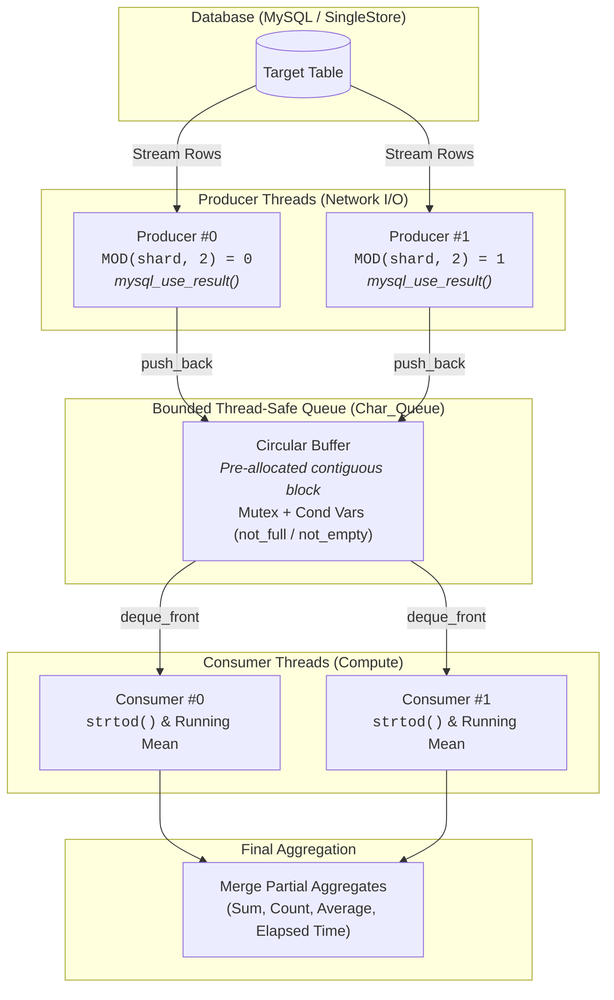

# Pure-C MySQL / SingleStore Database Connector & Streaming Pipeline

A high-performance, concurrent database client and streaming data aggregation pipeline implemented in pure C (**C17**). Built on top of the MySQL C Client API (`libmysqlclient`), this project demonstrates multi-threaded database ingestion, custom thread-safe data structures, cooperative cancellation with C11 atomics, and streaming row processing with an $O(1)$ memory footprint.

Originally engineered and tested against **SingleStore Cloud** and **MySQL 8.0+**, the engine is tailored for high-throughput numeric aggregation over large partitioned datasets without buffering entire result sets in memory.

---

## Features

- **Multi-Threaded Producer-Consumer Architecture**: Network ingestion is completely decoupled from data parsing and aggregation via POSIX threads (`pthread`).
- **Parallel Query Sharding**: Database producers concurrently query partitioned subsets using modular arithmetic sharding (e.g., `WHERE MOD(DAY(date), N) = thread_id`).
- **Unbuffered Streaming Processing**: Uses `mysql_use_result()` rather than `mysql_store_result()`, streaming rows directly off the network socket through a bounded circular buffer to guarantee bounded memory usage.
- **Custom Bounded Circular Queue (`Char_Queue`)**:
  - Implemented from scratch in pure C.
  - Pre-allocates a single contiguous 2D memory block for cache locality and minimal allocator churn.
  - Thread-safe synchronization via `pthread_mutex_t` and dual condition variables (`not_empty`, `not_full`) for full backpressure handling.
  - Broadcast shutdown protocol (`close_queue`) to gracefully drain consumers.
- **Cooperative Atomic State Machine**: Tracks operational health with C11 atomics (`_Atomic int`). Worker threads periodically inspect flags every `ROWS_PER_STATUS_CHECK` rows and terminate immediately if another worker encounters an error.
- **Cloud-Ready TLS Configuration**: Enforces TLSv1.2 and `mysql_native_password` authentication for secure connections to cloud databases like SingleStore Helios.
- **Interactive Schema Discovery**: Automatically queries available tables (`SHOW TABLES;`) and presents an interactive CLI selection menu before launching ingestion.
- **Microsecond Benchmarking**: Built-in monotonic timing (`clock_gettime` with `CLOCK_MONOTONIC`) providing precise execution duration and row throughput metrics.
- **AddressSanitizer (ASan) Integration**: First-class Makefile support for building with clang/gcc sanitizers to detect memory corruption, race conditions, or leaks.

---

## Architecture Overview



---

## Directory Structure

```text
.
├── Makefile              # Build configuration with ASan and mysql_config integration
├── include/
│   ├── char_queue.h      # Bounded circular queue interface and synchronization primitives
│   ├── mysql_utils.h     # Database connection setup, TLS options, and table prompts
│   ├── status_codes.h    # Status enum constants (STATUS_OK, STATUS_ERROR, STATUS_FINISHED)
│   └── utils.h           # Environment variable validation, timing, and Data_Aggregate helpers
├── src/
│   ├── char_queue.c      # Contiguous queue allocation, push/pop with backpressure, and teardown
│   ├── main.c            # Producer/consumer routines, thread lifecycle, sharding, and main loop
│   ├── mysql_utils.c     # mysql_real_connect implementation, TLS v1.2 setup, and table selection
│   └── utils.c           # Environment lookup, monotonic clock, and aggregate reduction logic
└── bin/                  # Output directory for compiled binaries
```

---

## Prerequisites

To build and run this project, make sure you have the following installed:

1. **C Compiler**: GCC or Clang with **C17** support.
2. **POSIX Threads**: `pthread` library.
3. **MySQL Client Library**: `libmysqlclient` or MariaDB client development headers (`mysql_config` must be available in your `PATH`).
   - **Debian / Ubuntu**:
     ```bash
     sudo apt-get update && sudo apt-get install -y build-essential default-libmysqlclient-dev
     ```
   - **Fedora / RHEL**:
     ```bash
     sudo dnf install -y gcc make mariadb-devel
     ```
   - **macOS (Homebrew)**:
     ```bash
     brew install mysql-client make
     export PATH="/opt/homebrew/opt/mysql-client/bin:$PATH"
     ```
   - **Windows (MSYS2 / MinGW-w64)**:
     ```bash
     pacman -S --needed base-devel mingw-w64-x86_64-toolchain mingw-w64-x86_64-libmariadbclient
     ```

---

## Configuration

The application expects database credentials supplied via environment variables:

| Variable | Description | Example |
| :--- | :--- | :--- |
| `SS_host` | Database hostname or endpoint | `svc-xxxx.singlestore.com` or `127.0.0.1` |
| `SS_port` | Database port | `3306` |
| `SS_user` | Database user | `admin` |
| `SS_pass` | Database password | `your_secure_password` |
| `SS_db`   | Target database schema name | `analytics_db` |

### Setting Environment Variables

**Linux / macOS (Bash / Zsh):**
```bash
export SS_host="svc-your-host.singlestore.com"
export SS_port="3306"
export SS_user="admin"
export SS_pass="your_password"
export SS_db="market_data"
```

**Windows (PowerShell):**
```powershell
$env:SS_host = "svc-your-host.singlestore.com"
$env:SS_port = "3306"
$env:SS_user = "admin"
$env:SS_pass = "your_password"
$env:SS_db   = "market_data"
```

---

## Building and Running

### 1. Compile the Project

Compile the release/debug binary using `make`:

```bash
make
```

To build with **AddressSanitizer (ASan)** to check for memory leaks, invalid reads/writes, and buffer overflows:

```bash
make SANITIZE=asan
```

To clean previous build artifacts:

```bash
make clean
```

### 2. Execute the Pipeline

Run the executable:

```bash
./bin/main
```

### 3. Example Execution Walkthrough

```text
All env variables successfully loaded.
- Host: svc-cluster.singlestore.com
- Port: 3306
- User: admin
- Password: [HIDDEN]
- Database: market_data
Successfully connected to host.
-------------------------------
Select Table:
[0] historical_prices
[1] trade_ticks
[2] portfolio_snapshots
0
Selected [0] historical_prices
-------------------------------
[Producer #0] SELECT price FROM historical_prices WHERE MOD(DAY(date), 2)=0
[Producer #1] SELECT price FROM historical_prices WHERE MOD(DAY(date), 2)=1
[Consumer #0] [Consumer #1] 
-------------------------------
[Producer #0] n=250000
[Producer #1] n=250000
[Consumer #1] n=248312, largest strlen=7
[Consumer #0] n=251688, largest strlen=7
-------------------------------
MySQL client library successfully closed.
Query sequence executed as intended.
Execution time: 1.482 seconds
Final result: 142.384192, n=500000, sum=71192096.00
```

---

## Pipeline Customization & Tuning

Key operational parameters can be adjusted via macro definitions in [src/main.c](src/main.c):

| Macro | Default | Description |
| :--- | :--- | :--- |
| `NUM_PRODUCERS` | `2` | Number of concurrent database query/fetch worker threads |
| `NUM_CONSUMERS` | `2` | Number of concurrent numerical aggregation worker threads |
| `QUEUE_SIZE` | `1000` | Maximum capacity of the bounded circular queue (backpressure threshold) |
| `MAX_DATA_LEN` | `15` | Maximum string length per numeric field element in the queue |
| `ROWS_PER_STATUS_CHECK` | `1000` | Frequency of checking the atomic abort status flag during row loops |
| `DATA_FIELD` | `"price"` | Column name to extract from the query results |
| `SHARDING_FIELD` | `"DAY(date)"` | Column or SQL expression used to partition queries across producers |

---

## Key Implementation Details

### Unbuffered Ingestion (`mysql_use_result`)
Standard MySQL client queries often invoke `mysql_store_result()`, which buffers the entire result set into client-side RAM before processing. For tables with tens of millions of rows, this can trigger out-of-memory (OOM) conditions. This project instead uses `mysql_use_result()`, streaming rows one-by-one directly from the socket into the bounded `Char_Queue`.

### Contiguous Circular Buffer
Instead of allocating each queue item individually via `malloc()`, `init_queue()` allocates a single continuous block:
```c
cq.data = calloc(capacity, sizeof(char *));
char *data_block = calloc(capacity, entry_size * sizeof(char));
for (size_t i = 0; i < capacity; i++) {
    cq.data[i] = data_block + (i * entry_size);
}
```
This design avoids memory fragmentation, improves CPU cache locality, and minimizes heap lock contention under heavy concurrency.

### Graceful Teardown and Early Cancellation
1. When all producers finish, the main thread invokes `close_queue()`, signaling all sleeping consumer threads to drain the remaining queue items before terminating.
2. If any producer or consumer hits an unexpected error (connection failure, missing column, syntax error), it sets `global_status` to `STATUS_ERROR` via `atomic_store()`. Other running threads detect this within `ROWS_PER_STATUS_CHECK` iterations and exit early, preventing deadlocks and hung processes.

